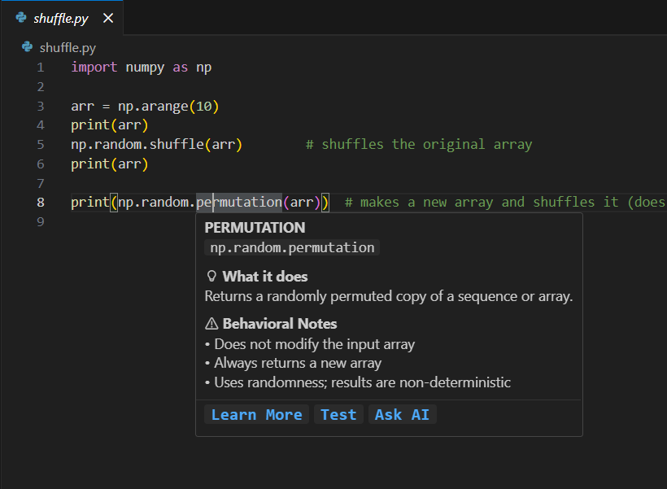

# Code Insights

**Code Insights** is a lightweight VS Code extension that helps you understand what common library functions *actually do*, directly inside the editor.

Instead of switching to documentation, it provides **inline explanations, behavioral notes, and structured insights** through hover tooltips and a sidebar.

This project focuses on **learning and correctness**, not execution.

---

## In Action

### Hover Insights
Quick, contextual explanations appear directly when hovering over a supported function.

### Learn More Sidebar
Deeper, structured information is available in a persistent side panel.

---

## What Problem Does This Solve?

Many bugs (especially for learners) come from misunderstandings such as:

- Does this function modify data in place?
- Does it return a new object or `None`?
- Why do two similarly named APIs behave differently?
- What are the practical side effects of calling this function?

Official documentation often explains *what* a function does, but not always **how it behaves in practice**.

**Code Insights makes these behaviors visible at the point of use.**

---

## Features (v0.1)

### Hover Insights
Hover over a supported function to see:
- A short description
- Key behavioral notes (e.g. in-place mutation, return value)
- Quick navigation actions (Learn More, Test, Ask AI)

### Learn More Sidebar
Click **Learn More** to open a side panel with:
- Function signature
- Clear description
- Main parameters (attributes)
- Usage examples
- Behavioral notes

### Test & 💬 Ask AI (Planned)
The UI includes **Test** and **Ask AI** sections to show the future direction of the tool.

In **v0.1**:
- These sections display **“Coming soon”**
- No code execution or AI calls are performed

This is intentional and documented.

---

## Installation

Install directly from the VS Code Marketplace by searching for **Code Insights**.

---

## Currently Supported Functions

This MVP focuses on a small, carefully chosen set of NumPy APIs:

- `np.random.shuffle`
- `np.random.permutation`
- `np.sort`
- `ndarray.sort`
- `np.reshape`
- `np.copy`

Each function includes:
- Parameter-level explanations
- Mutation vs non-mutation behavior
- Return semantics
- Simple usage examples

The data is defined using a structured JSON schema, making it easy to extend.

---

## How It Works

- The extension uses **static, curated metadata** (JSON) for known functions
- It does **not** analyze or execute your code
- Hover detection is heuristic-based (name matching)
- The sidebar is a single persistent panel with internal navigation

This keeps the extension:
- fast
- predictable
- safe to use in any project

---

## Limitations

This is an **MVP**. By design:

- No code execution
- No runtime inspection
- No AI responses yet
- No full semantic analysis
- Limited function coverage

The extension aims to **explain behavior**, not replace documentation or debugging tools.

---

## Planned Improvements

Future versions may include:
- Attribute-level interactive testing
- AI-powered explanations for custom code
- Support for more libraries (pandas, Python built-ins, etc.)
- Expanded datasets and examples

These features are intentionally **not** part of v0.1.

---

## Project Links

- **Source Code:** https://github.com/ShailPatel27/Code-Insights
- **Issues / Feedback:** https://github.com/ShailPatel27/Code-Insights/issues

## Status

**Version:** v0.1  
**Stage:** MVP (learning + exploration focused)

This is the first published version of the project and serves as a foundation for future work.

---

## License

MIT License
