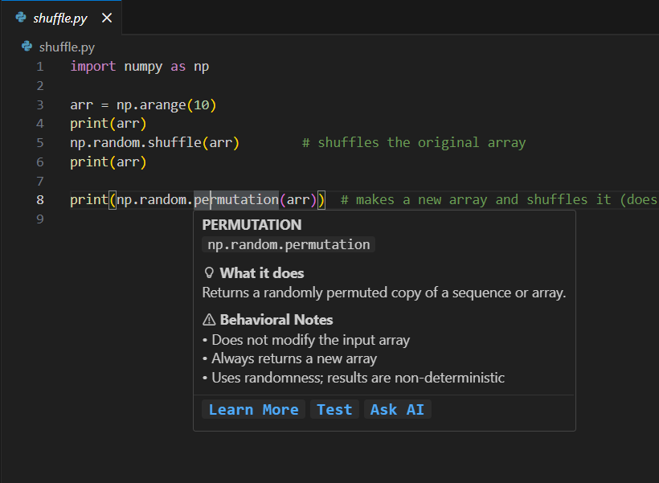
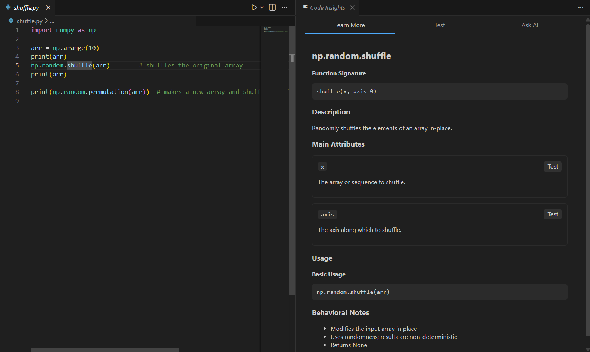

# Code Insights

**Code Insights** is a lightweight VS Code extension that helps you understand what common Python library functions actually do, directly inside the editor.

Instead of switching to documentation, it provides inline explanations, behavioral notes, guided examples, and structured insights through hover tooltips and a side panel.

This extension focuses on learning and correctness, not execution.

---

## In Action

### Hover Insights

Quick, contextual explanations appear directly when hovering over a supported function call.



### Learn More Sidebar

Deeper, structured information is available in a persistent side panel.



---

## What Problem Does This Solve?

Many bugs, especially for learners, come from misunderstandings such as:

* Does this function modify data in place?
* Does it return a new object or `None`?
* Why do two similarly named APIs behave differently?
* What behavior should I expect before I run the code?

Official documentation often explains what a function does, but not always how it behaves in practice.

**Code Insights makes these behaviors visible at the point of use.**

---

## Features (v0.4.0)

### Smarter Hover Detection

Hover insights are shown only for supported function calls, not for strings, comments, or unrelated variable names.

The extension resolves functions based on import context instead of simple word matching.

### NumPy Import Awareness

Supports common NumPy usage patterns, including:

* `np.random.shuffle(arr)`
* `np.sort(arr)`
* `np.copy(arr)`
* custom aliases such as `import numpy as nump`
* `from numpy.random import shuffle`

This makes hovers more accurate and predictable.

### Method Call Detection

Code Insights understands method calls on inferred objects, such as:

* `arr.sort()`
* `items.sort()`

The extension infers receiver type using simple assignment patterns such as `arr = np.arange(...)` and `items = [3, 1, 2]`.

Ambiguous cases are intentionally ignored to avoid misleading information.

### Python Built-in Insights

v0.4.0 expands beyond NumPy with curated insights for common Python behavior traps:

* `sorted(items)`
* `len(items)`
* `items.sort()`

This helps explain the difference between returning a new value and mutating an existing object.

### Learn More Sidebar

Click **Learn More** to open a side panel with:

* function signature
* clear description
* main parameters
* usage examples
* behavioral notes

### Guided Test Tab

The **Test** tab now shows a static guided example for supported functions.

Each guided test can include:

* a curated code sample
* short explanation notes
* expected behavior and output

Code Insights does not run the code. The Test tab is designed to help you understand the behavior safely before trying it yourself.

### Ask AI

The **Ask AI** tab can explain the currently selected function using your configured AI provider.

v0.4.0 supports:

* OpenAI
* Gemini

Ask AI includes:

* suggested FAQ-style starter questions
* multi-turn chats with previous-message context
* local chat history stored on your machine
* automatic chat names with a rename option
* selectable and deletable chats
* temporary chats that are not saved to disk
* automatic cleanup of saved chats after 30 days
* simple, short, detailed, and beginner-friendly response styles
* function-context toggle for focused or general questions
* copyable responses and code blocks
* styled Markdown responses with code blocks and responsive tables

The extension reads API keys and model choices from `.env` in your opened workspace, or from the extension folder during local development. Keys stay in the extension host and are not exposed to the webview.

Multiple keys can be provided as comma-separated fallbacks. If one key fails or hits a limit, Code Insights tries the next key.

Example `.env`:

```env
CODE_INSIGHTS_AI_PROVIDER=openai
CODE_INSIGHTS_AI_MODEL=gpt-4.1-mini
OPENAI_API_KEY=your_openai_key,your_backup_openai_key
GEMINI_API_KEY=your_gemini_key,your_backup_gemini_key
GEMINI_MODEL=gemini-2.5-flash
```

To use Gemini instead:

```env
CODE_INSIGHTS_AI_PROVIDER=gemini
CODE_INSIGHTS_AI_MODEL=gemini-2.5-flash
GEMINI_API_KEY=your_gemini_key
```

---

## Installation

Install directly from the VS Code Marketplace by searching for **Code Insights**.

---

## Currently Supported Functions

This version focuses on a small, carefully curated set of NumPy and Python APIs:

* `np.random.shuffle`
* `np.random.permutation`
* `np.sort`
* `ndarray.sort`
* `np.copy`
* `sorted`
* `len`
* `list.sort`

Each function includes:

* parameter-level explanations
* mutation vs non-mutation behavior
* return semantics
* usage examples
* guided static tests

The data is defined using a structured JSON schema, making it easy to extend.

---

## How It Works

* The extension uses static, curated metadata stored in JSON.
* It does not analyze or execute your code at runtime.
* Function detection is resolver-based and uses import context.
* The side panel is a single persistent webview with internal navigation.
* Guided tests are static learning examples, not executed programs.

This keeps the extension fast, predictable, and safe to use in any project.

---

## Limitations

Code Insights is still an early-stage project. By design:

* no code execution
* no runtime inspection
* no full semantic analysis
* limited function coverage
* local JSON chat storage only; cloud sync may come later

The extension aims to explain behavior, not replace documentation or debugging tools.

---

## Planned Improvements

Future versions may include:

* expanded method support beyond NumPy arrays
* support for additional libraries such as pandas
* richer guided examples
* additional AI providers such as Claude

These features are intentionally not part of v0.4.0.

---

## Project & Branding

**Code Insights** is developed under **Lenex**.

Website: [https://lenex.dev](https://lenex.dev)

---

## Project Links

* **Source Code:** [https://github.com/ShailPatel27/Code-Insights](https://github.com/ShailPatel27/Code-Insights)
* **Issues / Feedback:** [https://github.com/ShailPatel27/Code-Insights/issues](https://github.com/ShailPatel27/Code-Insights/issues)

---

## Status

**Version:** v0.4.0

**Stage:** Early development (guided static insights, learning + correctness focused)

This release introduces Python built-in insights, broader resolver coverage, the guided Test tab, persistent local Ask AI chats for OpenAI/Gemini, and fixes packaged installs so bundled insight data is available from the Marketplace version.

---

## License

MIT License
